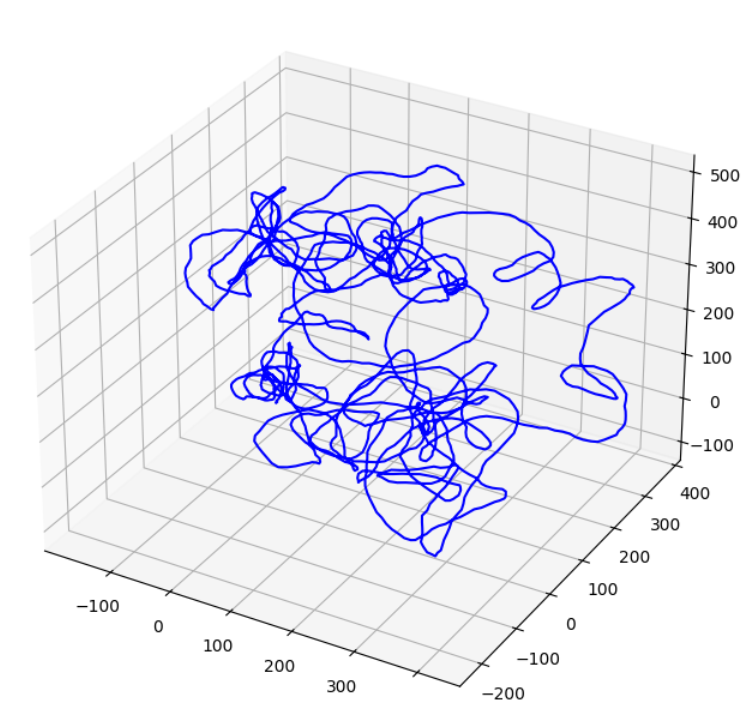

This repository is just me playing around with different functionalities of SymForce so that I can learn new stuff!

Results:

Pose Graph optimisation using Symforce on dataset available on [Luca Carlone's dataset](https://lucacarlone.mit.edu/

| Dataset | Before Optimization | After Optimization |
|---------|--------------------|-------------------|
|[sphere_bignoise_vertex3.g2o](https://www.dropbox.com/s/ej5hb1ckcp3x42u/sphere_bignoise_vertex3.g2o?dl=0)|  | 
<!-- |[parking-garage.g2o](https://www.dropbox.com/s/zu23p8d522qccor/parking-garage.g2o?dl=0)|  |  -->
